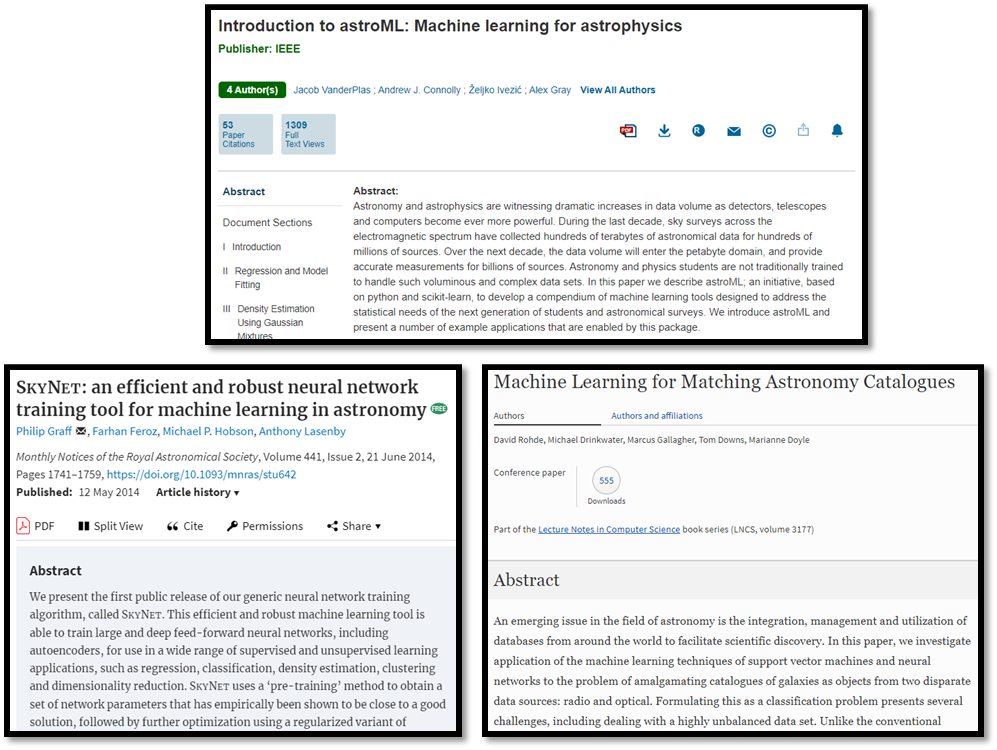
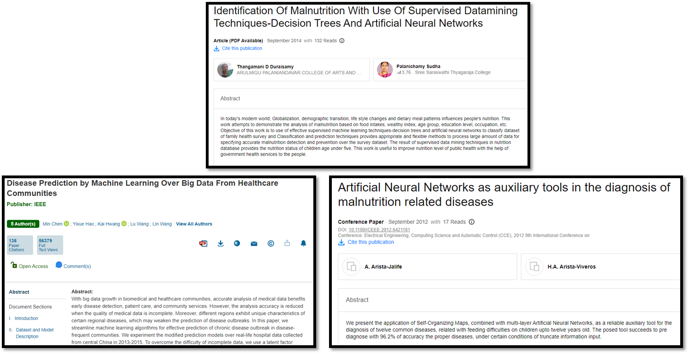

[`Machine Learning`](../Readme.md) > `Sesión 01`

## Sesión 01: Introducción a Machine Learning

### 1. Objetivos :dart: 
- Identificar los conceptos básicos de Machine Learning (como estructura, funcionamiento, algoritmos en Python 3)

### 2. Contenido :blue_book:

---
##### <ins>¿Qué es Machine Learning?</ins>

El aprendizaje automático, o *Machine Learning* en inglés, es una tecnología que permite a las computadoras aprender y tomar decisiones sin necesidad de ser programadas explícitamente. En lugar de escribir un conjunto de reglas específicas para realizar una tarea, como reconocer imágenes o predecir el tiempo, se alimenta a la computadora con datos y algoritmos que le permiten aprender automáticamente patrones y hacer predicciones basadas en esos datos.

Es una manera de enseñar a una computadora a reconocer patrones y tomar decisiones por sí misma a través de la experiencia y los datos, en lugar de darle instrucciones paso a paso. Esto lo hace especialmente útil en una amplia gama de aplicaciones, desde el reconocimiento facial hasta la recomendación de películas en plataformas de streaming.

- [**`EJEMPLO 1`**](Ejemplo-01/Readme.md)
- [**`RETO 1`**](Reto-01/Readme.md)
- [**`RETO 2`**](Reto-02/Readme.md)

---
##### <ins>¿Cómo aprende una computadora?</ins>
Aprender consiste en *Reconocer los errores y corregirlos para tratar de no cometerlos de nuevo.* Tanto en Machine Learning como en la vida diaria, si no eres capaz de reconocer un error, no eres capaz de corregirlo, por tanto no aprenderás.

El principal indicador de que estás aprendiendo (o de que tu sistema está aprendiendo) es que **conforme el tiempo pasa, la probabilidad de cometer un error disminuye drásticamente.**

Existen varias maneras de aprender, pero hablar de todas ellas sería desviar nuestra conversación hacia la rama de la psicología del aprendizaje. La que nos interesa por ahora va más encaminada hacia los procesos condicionantes de Pavlov: 

- Un refuerzo positivo: Cada vez que el sistema hace lo que yo espero, le doy una recompensa.
- Un refuerzo negativo: Cada vez que el sistema hace algo que no esperaba, le doy un castigo.

Para entender cómo funciona este condicionamiento de Pavlov en sistemas, necesitaremos ver un poco acerca de cómo funcionan las derivadas.

Una derivada tiene un montón de definiciones, eso lo sabemos bien desde la preparatoria, pero de entre todas las definiciones, la que mas nos interesa es la que reza: *"Una derivada es una razón de cambio"*

O en un lenguaje mas coloquial: *"Una derivada nos dice que tantos cambios hay entre dos puntos. Nos dice también si la función crece o decrece en un intervalo dado."* 

Usamos derivadas como la medida de qué tantos errores comete un sistema. A mayor derivada, mas errores comete, y el objetivo de nuestros sistemas de Machine Learning es **reducir esa derivada a lo mínimo posible**

Veamos algunos ejemplos interesantes de cómo las derivadas hacen cosas con Machine Learning. 

- [**`EJEMPLO 2`**](Ejemplo-01/Readme.md)

---

## Aplicaciones de Machine Learning en la Industria

Machine Learning ha tenido un auge enorme por una simple razón: Problemas que antes eran intratables ahora pueden atacarse con estas herramientas. Si todavía no tienes un proyecto en mente que quieras hacer, podemos ver algunas cuantas áreas que se han visto beneficiadas de Machine Learning.

### Industria Manufacturera:

Los algoritmos de Machine Learning ha sido empleados en construir semiconductores, también para optimizar tareas de trabajo en manufactura.

### Seguridad y prevención del crimen:

Los algoritmos de Machine Learning también ayudan a hallar la relación entre el crimen y el estado de la sociedad. Es un tema difícil en el que ML comienza a buscar patrones para prevenir el crimen.

### Finanzas y economía:

Machine Learning brilla cuando tiene que generar tecnología que mapee finanzas o problemas económicos. Dado que la economía es un tema complejo, ML busca patrones entre las variables económicas.

### Astrofísica y ciencias espaciales.

Dado que las ciencias espaciales están teniendo mas datos cada vez, necesitan cada vez mas de ML para darles sentido y entender los datos.

### Salud pública y prevención.

Incluso los sistemas y servicios de salud se pueden ver beneficiados por Machine Learning, una de sus aplicaciones puede ser el análisis de políticas de salud y métodos de cuidado de pacientes. 

### Arte y creatividad

Las industrias creativas están siendo profundamente transformadas por ML en este momento. ¡Estos algoritmos generativos nos están haciendo cuestionar qué significa ser creativo y cómo funciona la creatividad! Midjourney, Dall-e, Stable Diffusion, ChatGPT, etc son algunos de los ejemplos más sonados en este momento.

Otros algoritmos existen para generar voz a partir de texto, para generar música, para cambiar el timbre de la voz ¡y muchas cosas más!

## Reto 04:
> ¿Qué industria podría verse beneficada por Machine Learning? ¿Conoces algún caso en el cual se pueda ver beneficiado? **PROTIP:** Un programador debe de saber de todo. Si entiendes un área del conocimiento, puedes generar tecnología de ello. 

## Descriptores para Machine Learning.

###  Entonces ¿Qué es un descriptor?

Después de este reto, vamos a ver que es un descriptor: Una máquina es muy buena para entender cualquier cosa que tenga que ver con números. Y un descriptor sirve para asociarle números a propiedades del mundo real. 

La función de un descriptor es esa misma: *describir* un objeto por medio de números y propiedades, de tal manera que los algoritmos de ML sean capaces de tratarlos para diferenciar entre un objeto y otro. La manera en la que estos objetos son descritos es por medio de sensores.

En esta imagen podemos ver varios descriptores: Una onda de sonido representada numéricamente, un espacio de color, o un algoritmo llamado *Local Binary Pattern* (LBP)

Veamos como funcionan de manera práctica con el siguiente ejemplo: Imaginemos que tienes un separador de frutas (como manzanas). Los objetos rojos son manzanas maduras, los objetos verdes pueden ser frutas inmaduras, y los objetos de otro color podrían ser cualquier otra cosa que no es una fruta.

Y bien, ¿qué es mejor? ¿Un descriptor o un algoritmo? Sorpresivamente es mejor tener un gran descriptor que un gran algoritmo.
- Un gran descriptor puede darte un excelente resultado, aún con un algoritmo mediocre.
- Un descriptor malo te da mucha ambiguedad y malos resultados. No importando que tan inteligente sea tu algoritmo. 

###  Problemas con los descriptores.

No siempre los descriptores que elegimos son los mejores para la tarea. Tenemos que ser cuidadosos a la hora de elegirlos porque puede que no sirvan para ello. Por ejemplo: El encontrar objetos por color...

Igualmente, hay propiedades que no funcionan de la misma manera en todo el mundo. Por ejemplo, supongamos que tratas de clasificar a personas por su estatura, y si dices:

> *Asumamos que los hombres son mas altos que las mujeres*

Esto puede ser cierto en casi todos los países del mundo, excepto en Holanda, ¡Donde las mujeres suelen ser mas altas que los hombres!

Con lo que hemos visto en esta sesión, es momento de pasar al reto final de la sesión 01:

## Reto 05:
> Con lo visto hasta ahora, define un proyecto de Machine Learning que crearás al final del módulo. Puedes discutir conmigo su viabilidad y la estrategia que vamos a seguir. Recuerda: No pienses en la tecnología. Piensa en como la tecnología puede ayudar al mundo. 

