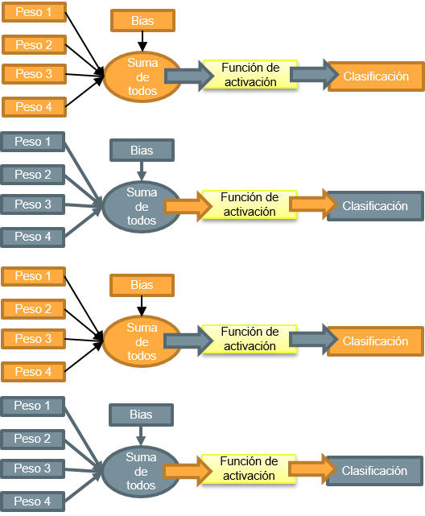
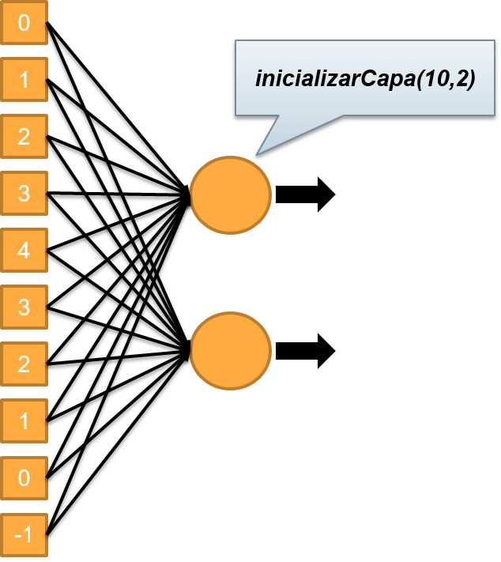

[`Machine Learning`](../README.md) > `Sesión 06`

## Sesión 06: Redes neuronales artificiales

### 1. Objetivos :dart: 
- Construir una red neuronal artificial y entender los procedimientos del algoritmo de descenso en gradiente para predicción y clasificación supervisada.

### 2. Contenido :blue_book:

---
#### <ins>El problema del XOR</ins>

El problema del XOR es un desafío en el campo de la lógica y el aprendizaje automático. Se refiere a la dificultad de encontrar una única función lógica (o modelo matemático) que pueda tomar dos valores binarios (0 y 1) como entrada y producir la salida correcta de XOR (exclusivo OR). El XOR es una operación que devuelve 1 si exactamente uno de los valores de entrada es 1, y 0 en cualquier otro caso.

El problema radica en que no se puede encontrar una única combinación lineal de las entradas (como lo haría una operación AND o OR) para obtener la salida correcta del XOR. Esto contrasta con otras operaciones lógicas simples que son linealmente separables. Resolver el problema del XOR requiere modelos de aprendizaje automático no lineales, como redes neuronales con capas ocultas, que pueden capturar las relaciones no lineales entre las entradas y las salidas para resolver este problema. El XOR es un ejemplo clásico para ilustrar la importancia de las redes neuronales y otros modelos no lineales en la resolución de problemas más complejos de clasificación y regresión.

- [**`EJEMPLO 1`**](Ejemplo01.ipynb)

---
#### <ins>Funciones de activación</ins>

Una función de activación es una función matemática utilizada en redes neuronales y otros modelos de aprendizaje automático para introducir no linealidad en la salida de una neurona o unidad. Estas funciones determinan si una neurona debe "activarse" (producir una salida) o no, en función de su entrada ponderada. Algunas funciones de activación comunes incluyen la función sigmoide, la función ReLU (Rectified Linear Unit) y la función tangente hiperbólica (tanh). Estas funciones permiten a las redes neuronales capturar relaciones no lineales en los datos, lo que las hace adecuadas para resolver una amplia gama de problemas de aprendizaje automático, como clasificación y regresión.

- [**`RETO 1`**](Reto01.ipynb)

---
#### <ins>Programando funciones de activación</ins>

Aquí tienes una breve explicación de algunas de las funciones de activación más comunes en redes neuronales:

**Función Sigmoide (Sigmoid):**

- La función sigmoide mapea cualquier valor de entrada a un rango entre 0 y 1.
- Se utiliza comúnmente en capas de salida para problemas de clasificación binaria, ya que produce probabilidades.
- Sin embargo, tiende a sufrir el problema de la "desaparición del gradiente" en redes profundas.

**Función ReLU (Rectified Linear Unit):**

- La función ReLU asigna cualquier entrada negativa a cero y deja las entradas positivas sin cambios.
- Es ampliamente utilizada debido a su simplicidad y eficacia en la práctica.
- Ayuda a abordar el problema de la desaparición del gradiente y acelera el entrenamiento de redes profundas.

**Función Tangente Hiperbólica (tanh):**

- La función tanh mapea cualquier valor de entrada a un rango entre -1 y 1.
- Similar a la función sigmoide, pero con un rango de salida centrado en cero.
- Se utiliza en capas ocultas de redes neuronales y puede ayudar en la convergencia del entrenamiento.

**Función Softmax:**

- La función softmax se utiliza en la capa de salida de una red neuronal para problemas de clasificación multiclase.
- Transforma un vector de números reales en una distribución de probabilidad sobre varias clases.
- Es útil cuando se necesita asignar una probabilidad a cada clase de salida.
- Estas son solo algunas de las funciones de activación comunes, y la elección de la función de activación adecuada depende del problema que se esté abordando y la arquitectura de la red neuronal. Cada función de activación tiene sus propias ventajas y desventajas, y a menudo se experimenta con varias de ellas para obtener el mejor rendimiento en una tarea específica.

- [**`EJEMPLO 2`**](Ejemplo02.ipynb)
- [**`RETO 2`**](Reto02.ipynb)

---
#### <ins>Conectando neuronas con Numpy</ins>
Ahora mismo, con los retos 1 y 2 hemos creado una sola neurona. Sin embargo, una red neuronal en realidad tiene múltiples neuronas e incluso múltiples capas entre las neuronas, como puedes observar en la siguiente imagen:

Sin embargo, programar una red neuronal, neurona por neurona, puede ser leeeento y extenuante. Por ende, NumPy nos puede ayudar a hacer esta misma tarea en un solo paso:si tienes una neurona artificial ya programada y múltiples entradas numpy.dot puede hacer que las entradas se mapeen directamente con los pesos sin que tengas que programar nada más.

Recordando lo que hablamos en el Prework de esta sesión, el producto punto que implementa np.dot te puede ayudar a conectar filas con columnas: Como no podemos conectar filas con filas, necesitas hacer una transposición de la matriz. En otras palabras, sacar la matriz transpuesta de los pesos W, para que se conecten de esta manera:

- [**`EJEMPLO 3`**](Ejemplo03.ipynb)

---
#### <ins>Capas neuronales: Creando redes</ins>
Con lo que hemos programado en los retos anteriores, ahora mismo hemos creado una sola capa de neuronas. Todas las neuronas de esa capa buscan una misma solución. Sin embargo, todas las neuronas de esa capa son independientes y no se comunican entre sí. 

A diferencia de los random forests, una red neuronal podría verse beneficiada de que cada una de las neuronas se comuniquen para que combinemos los resultados.

Para hacer la comunicación, podemos crear una segunda capa neuronal que recolectará las decisiones de la primera capa y utilizará los datos para tomar la decisión, de la siguiente manera: 

- [**`EJEMPLO 4`**](Ejemplo04.ipynb)

---
#### <ins>Bibliotecas de redes neuronales en Python</ins>
Aunque Scikit learng se centra principalmente en algoritmos tradicionales de aprendizaje automático, no incluye implementaciones directas de redes neuronales profundas. Sin embargo, puede utilizar la biblioteca MLPClassifier configurar redes neuronales básicas.

Otra biblioteca más usada para configurar redes neuronales es Tensorflow.

Veamos ejemplos de ambas. 

- [**`EJEMPLO 5`**](Ejemplo05.ipynb)
- [**`RETO 3`**](Reto03.ipynb)

---

 

[`Anterior`](../Sesion-04/README.md) | [`Siguiente`](../Sesion-06/README.md)      
