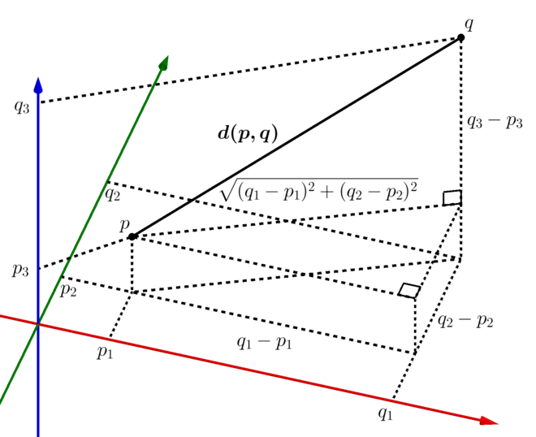

[`Machine Learning`](../../README.md) > [`Sesión 01`](../README.md) > `Ejemplo 3`

## Ejemplo 3: Métodos de aprendizaje

### 1. Objetivos :dart:

- Entender distintos métodos matemáticos en que aprende la computadora.

### 2. Desarrollo :rocket:

#### Método de aprendizaje 1: Descenso en Gradiente.

La idea del descenso en gradiente es tratar de hallar el mínimo error posible. Cuando un punto ha llegado hasta abajo en una gráfica de una superficie, llega al mínimo error. Por ejemplo, observa esta gráfica: 

En este caso la esfera desciende hasta llegar al mínimo error. Esto quiere decir que el sistema ha aprendido eficazmente. Sin embargo, debes de saber que hay veces en las que ese error no siempre se reduce y se queda estancado, a eso se le llama un *"mínimo local"*. Tristemente eso no nos sirve de nada en una I.A. Ya que un mínimo local suele fallar muchisimo.

#### Método de aprendizaje 2: Comparativas.

Entonces, un método de aprendizaje que te puede servir muchisimo (sobre todo en las siguientes dos sesiones) es el método de comparativas. Y es bastante sencillo de implementar: 

- Toma un dato y comparalo contra otros. 
  - Si el dato es parecido, quiere decir que son del mismo conjunto. 
  - Si el dato no se parece mucho, quiere decir que no son del mismo conjunto. 

Para ello debe haber una manera eficaz de comparar dos datos. Una manera de comparar eficazmente se llama **Distancia Euclidiana**

Antes de que nos asustemos por tantas ecuaciones, tomemos en cuenta lo siguiente: La mejor manera de comparar dos datos es por medio de distancias: La distancia nos dice que tanto (numéricamente) dos datos se parecen.

- ¿Los datos son iguales? Las distancias son cero. 

- ¿Los datos son diferentes? Las distancias son mayores a 0. 

Como tip, si puedes medir un dato variable contra un valor fijo de referencia, siempre puedes ajustar ese dato para acercarte al "ideal". 

Por ejemplo, supongamos que tenemos dos muestras (u objetos) que queremos comparar: A y B. Supongamos también que los objetos son un vector cada uno, con un solo dato en el índice 0.

$ A = [3]$

$ B = [7]$

La distancia entre A y B está dado por la diferencia (o la resta) de estos dos. Pero la distancia la vamos primero a elevar al cuadrado y luego sacarle raíz cuadrada (para que siempre sea un valor positivo) Entonces...

$ distancia(A,B) = \sqrt{(3 - 7)^2} = \sqrt{(-4)^2} = 4$ 

Si, ahora mismo esto parece un *overkill* y no hay necesidad de tanta violencia para un dato. Pero supongamos que ahora A y B tienen 2 datos en su vector en lugar de uno solo.

$ A = [3,5]$

$ B = [7,10]$

El ejemplo funciona exactamente igual:

$ distancia(A,B) = \sqrt{(3 - 7)^2 + (5 - 10)^2} = \sqrt{(-4)^2 + (-5)^2} = \sqrt{16 + 25} = 6.403124$  

Habiendolo entendido para 2 valores, podemos extenderlo a cuantos valores quieras.

$ distancia(A,B) = \sqrt{(A_1 - B_1)^2 + (A_2 - B_2)^2 + \cdots} = \sqrt{\sum_{i=1}^N{(A_i - B_i)^2}}$  

Felicidades, esta es la fórmula de la distancia euclidiana, y ahora puedes comparar que tan parecidos son dos puntos.

[`Anterior`](../Ejemplo02/README.md) | [`Siguiente`](../Reto03/README.md)

